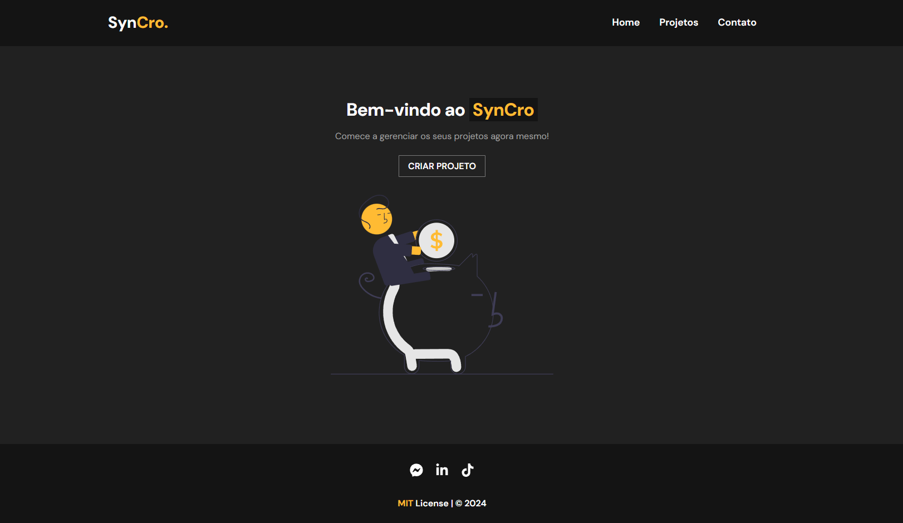

# **Syncro - Gerenciador de Projetos**

**Syncro** é uma aplicação web desenvolvida em React para gerenciar projetos e seus serviços associados. Ele permite criar, editar e excluir projetos, adicionar serviços, e controlar custos de forma prática e eficiente.



---

## **🛠 Tecnologias Utilizadas**
- **Frontend:**
  - React.js
  - CSS Modules
  - React Router DOM

- **Backend (Mockado):**
  - JSON Server (para simular uma API RESTful)

---

## **📦 Docs**
Primeiro, clone o projeto:
```bash
git clone https://github.com/Guilherme-Rigobello/SynCro.git

cd syncro
```
Para instalar as dependências, utilize:
```bash
npm install
```

Após, execute os seguintes comandos para executar o projeto:
```bash
npm start
```
Abra http://localhost:3000 em seu navegador.

```bash
npm run backend
```
Isso irá iniciar o servidor mock do backend na URL http://localhost:5000.

