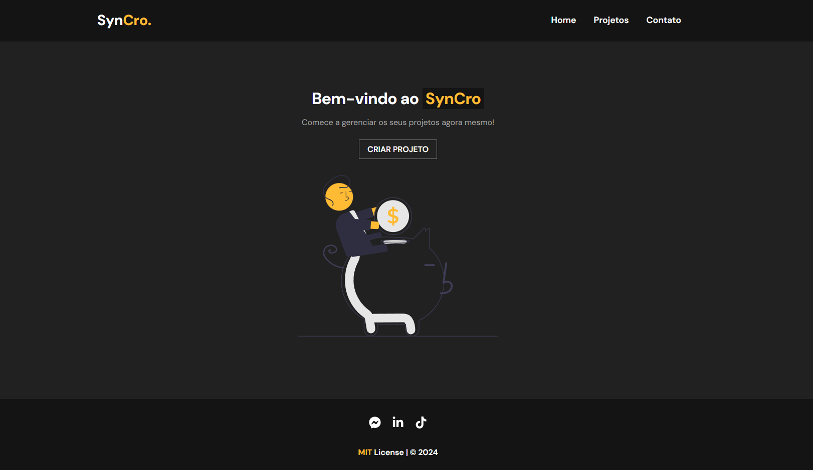

# 📋 **Syncro - Gerenciador de Projetos**

Syncro is a web application developed in React to manage projects and their associated services. It allows you to create, edit, and delete projects, add services, and control costs in a practical and efficient way.



---

## **🛠 Technologies Used**
- **Frontend:**
  - React.js
  - CSS Modules
  - React Router DOM

- **Backend (Mocked):**
  - JSON Server (para simular uma API RESTful)

---

## **📦 Docs**
First, clone the project:
```bash
git clone https://github.com/Guilherme-Rigobello/SynCro.git

cd syncro
```
To install the dependencies, use:
```bash
npm install
```

Then, run the following commands to start the project:
```bash
npm start
```
Open http://localhost:3000 in your browser.

```bash
npm run backend
```
This will start the backend mock server at the URL http://localhost:5000.

